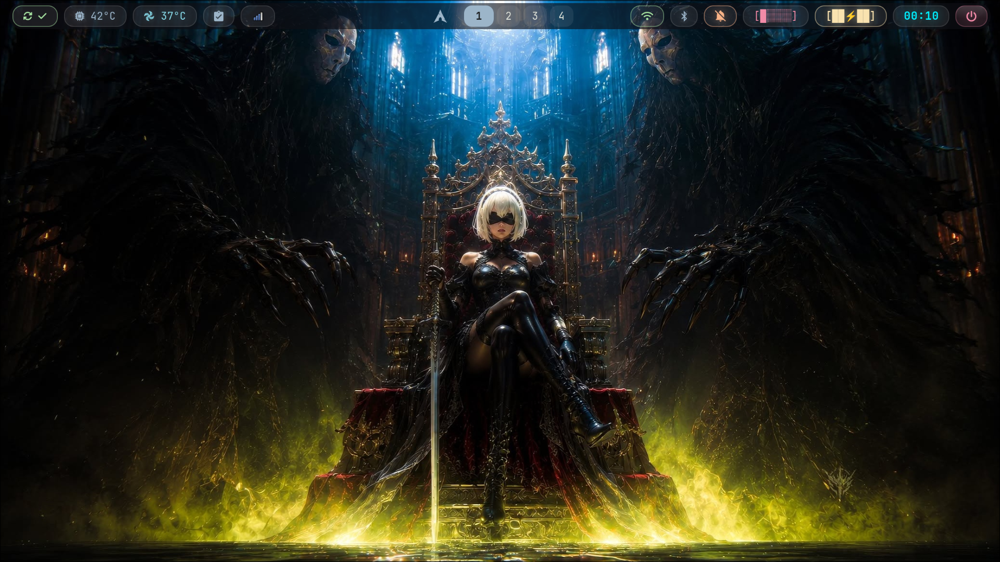
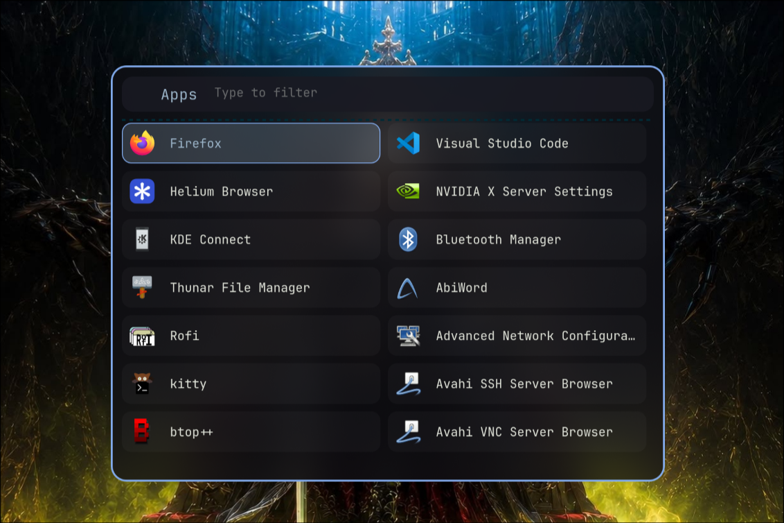
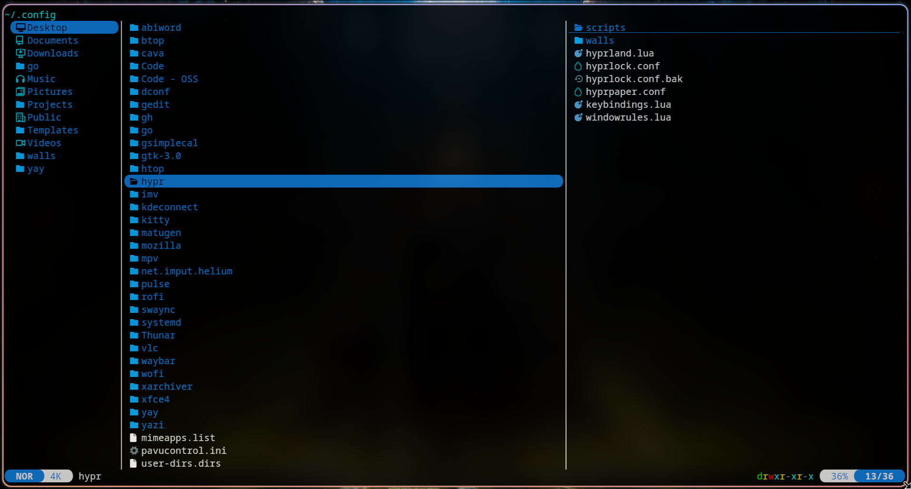

# 🌙 ShadowArch Dotfiles

> **Beautiful, minimal Arch Linux + Hyprland dotfiles with Catppuccin aesthetics**


---

## 📸 Gallery  

<div align="center">


*Desktop Overview - Hyprland with Waybar*

</div>

### 🚀 Launcher & File Manager

<table>
  <tr>
    <td align="center"><br/><b>Rofi Launcher</b></td>
    <td align="center"><br/><b>Yazi File Manager</b></td>
  </tr>
</table>

---

## ⚡ Quick Start

### Prerequisites
- Arch Linux (or Arch-based distro)
- Hyprland installed
- Git

### Installation

```bash
# Clone the repository
cd ~
git clone https://github.com/yourusername/ShadowArch.git
cd ShadowArch

# Run the installer (creates symlinks)
chmod +x install.sh
./install.sh
```

### Manual Installation

```bash
# Copy config files to your home directory
cp -r hypr/.config/hypr ~/.config/
cp -r waybar/.config/waybar ~/.config/
cp -r rofi/.config/rofi ~/.config/
# ... and so on for other components
```

---

## 🏗️ Repository Structure

```
ShadowArch/
├── hypr/           # Hyprland WM config (keybindings, rules, scripts)
├── waybar/         # Status bar configuration & scripts
├── rofi/           # App launcher, power menu, cliphist
├── wofi/           # Emoji picker, app launcher
├── yazi/           # Terminal file manager with themes
├── cava/           # Audio visualizer with shaders
├── swaync/         # Notification center
├── Thunar/         # File manager actions
├── gtk-3.0/        # GTK theme settings
├── imv/            # Image viewer config
├── htop/           # Process monitor config
├── systemd/        # User services (cliphist, waybar)
├── shell/          # Bash configs (.bashrc, .bash_profile)
├── vscode/         # VS Code settings
├── meta/           # Package lists (pacman, AUR, extensions)
├── assets/         # Screenshots for README
├── install.sh      # Installation script
├── LICENSE         # MIT License
└── README.md       # This file
```

---

## 🎨 Components

### 🪟 Hyprland (Wayland Compositor)
- Tiling window manager with smooth animations
- Custom keybindings (see [keybindings.lua](hypr/.config/hypr/keybindings.lua))
- Window rules for specific applications
- Screenshot utilities with Flameshot

### 📊 Waybar (Status Bar)
- Custom modules for system monitoring
- Network, Bluetooth, Volume controls
- Workspace indicator
- Clock and date display
- [23 custom scripts](waybar/.config/waybar/scripts/) for extended functionality

### 🚀 Rofi (Application Launcher)
- Glass-themed app launcher (`SUPER+SPACE`)
- Power menu with shutdown/reboot options
- Bluetooth pairing menu
- Network selection menu
- Cliphist clipboard manager integration

### 😊 Wofi (Emoji Picker)
- Quick emoji insertion (`SUPER+.`)
- Alternative app launcher
- Custom styling with Catppuccin colors

### 📁 Yazi (Terminal File Manager)
- Fast, Rust-based file manager
- 5 color themes included:
  - Catppuccin Mocha, Macchiato, Frappe, Latte
  - Dracula
- Image preview support
- Vim-like navigation

### 🎵 Cava (Audio Visualizer)
- Real-time audio spectrum analyzer
- Custom GLSL shaders:
  - Northern Lights
  - Eye of Phi
  - Winamp-style spectrum
  - Spectrogram view

### 🔔 SwayNC (Notification Center)
- Beautiful notification popups
- Control center with quick settings
- Do Not Disturb mode
- Custom CSS styling

### 🖼️ Hyprlock (Lock Screen)
- Secure screen locking
- Custom design with time/date display
- Password input field
- Blur effects

---

## 📦 Required Packages

### Pacman Packages
See [`meta/pacman-packages.txt`](meta/pacman-packages.txt) for the complete list (112 packages).

**Key packages:**
```
hyprland waybar rofi wofi yazi cava swaync thunar imv htop
kitty flameshot cliphist brightnessctl blueman networkmanager
pipewire pavucontrol polkit-gnome xdg-desktop-portal-gtk
```

### AUR Packages
See [`meta/aur-packages.txt`](meta/aur-packages.txt) (12 packages).

**Key AUR packages:**
```
swww (or hyprpaper)
nerd-fonts-complete
catppuccin-gtk-theme
```

### VS Code Extensions
See [`meta/vscode-extensions.txt`](meta/vscode-extensions.txt) (9 extensions).

---

## 🖼️ Wallpapers

The wallpapers are **not included** in this repository to keep it lightweight.

### Recommended Setup
1. Download your favorite wallpapers
2. Place them in `~/Pictures/wallpapers/`
3. Update [`hyprpaper.conf`](hypr/.config/hypr/hyprpaper.conf) with your wallpaper path

Or use SWWW for animated wallpapers:
```bash
swww init
swww ~/path/to/wallpaper.gif
```

---

## ⌨️ Essential Keybindings

| Keybinding | Action |
|------------|--------|
| `SUPER + SPACE` | Open Rofi launcher |
| `SUPER + .` | Open Wofi emoji picker |
| `SUPER + SHIFT + V` | Open Cliphist clipboard |
| `SUPER + ENTER` | Open terminal (Kitty) |
| `SUPER + Q` | Close active window |
| `SUPER + D` | Toggle SwayNC |
| `PRINT` | Full screenshot (Flameshot) |
| `SUPER + PRINT` | Select area screenshot |
| `SUPER + SHIFT + E` | Power menu |
| `SUPER + B` | Toggle waybar |
| `SUPER + [0-9]` | Switch to workspace |

> Full keybindings list: [`hypr/.config/hypr/keybindings.lua`](hypr/.config/hypr/keybindings.lua)

---

## 🔧 Customization

### Change Colors
Edit the color variables in:
- [`waybar/.config/waybar/style.css`](waybar/.config/waybar/style.css)
- [`rofi/.config/rofi/glass.rasi`](rofi/.config/rofi/glass.rasi)

### Add New Scripts
Place custom scripts in [`waybar/.config/waybar/scripts/`](waybar/.config/waybar/scripts/) and reference them in the waybar config.

### Modify Keybindings
Edit [`hypr/.config/hypr/keybindings.lua`](hypr/.config/hypr/keybindings.lua)

---

## 🔒 Security

This project follows a strict security policy. Please review our [Security Policy](SECURITY.md) before installation.

**Important Notes:**
- Review all scripts before running
- The `install.sh` creates symlinks (non-destructive)
- No sudo access required for most features
- Check [`SECURITY.md`](SECURITY.md) for vulnerability reporting

---

## 🤝 Contributing

Contributions are welcome! Please follow these steps:

1. Fork the repository
2. Create a feature branch (`git checkout -b feature/amazing-feature`)
3. Commit your changes (`git commit -m 'Add amazing feature'`)
4. Push to the branch (`git push origin feature/amazing-feature`)
5. Open a Pull Request

### Guidelines
- Test all changes on a clean Arch installation
- Keep file sizes minimal (no large binaries)
- Follow existing code style
- Document new features in README

---

## 📄 License

This project is licensed under the [MIT License](LICENSE).

---

## 🙏 Acknowledgments

- [Hyprland](https://hyprland.org/) - Amazing Wayland compositor
- [Catppuccin](https://catppuccin.com/) - Beautiful color palette
- [Dracula Theme](https://draculatheme.com/) - Dark theme inspiration
- [Rofi](https://github.com/davatorium/rofi) - Versatile launcher
- [Waybar](https://github.com/Alexays/Waybar) - Feature-rich bar
- [Yazi](https://yazi-rs.github.io/) - Blazing fast file manager

---

## 📞 Support

- **Issues:** [GitHub Issues](https://github.com/yourusername/ShadowArch/issues)
- **Discussions:** [GitHub Discussions](https://github.com/yourusername/ShadowArch/discussions)

---

<div align="center">

**Made with ❤️ by Aifahamed E (ShadowArch)**

⭐ Star this repo if you find it useful!

</div>
